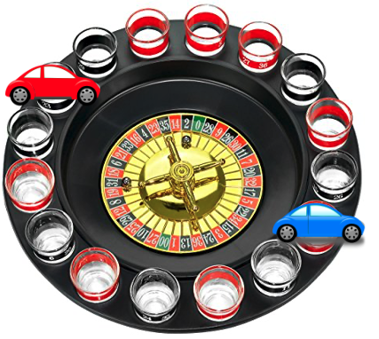

# DDR_Coin

## Designated Driver (DD) Roulette

### Background
Blockchain token system used to determine who will be designated driver among a group of friends when they go out

### Motivation 
To have a system in place for everyone to get home safely without one person always getting stuck being the DD, or the person who is supposed to be DD backing out and stranding everyone

### Questions to answer
* What is the consequence for not fulfilling your obligation if you are chosen as the DD
* Who will be included in your group
* What will be the incentive to participate
* Is this an ongoing system or one contract per event

### Instructions
To install the Web3.py library, check that your dev environment is active, and then run the following:
pip install web3==5.17

Create contract DDRCoin. Deploy contract. 
Name: DDRCoin
Symbol: DDR
Inital_supply: 40

// owner address: 0xD81b7D4224c017FC839Dc2a95D77Fbb6237B8383
// Created contract address: 0x4214cd132c3FB02d1f26288aBc0eCB70f0fdA0d3

// Create wallet for 4 individuals. Transfer 10 coins to each wallet

* Account1: Susannah = 0x1499112bF48CbCBe1023A9dA7f6bA40e88d28c81
* Account2: Sarah = 0xED8706cf7294f1c4F76D54EBEbD3b48D78C72CA6
* Account3: Callie = 0x9D3aD9827e8901AB4499BCbDBC3c48615780dbDF
* Account4: Gabriel = 0xEC9e323F61BCC0B23D40f779C1aC0AE43AE20264

// Add functions to store address and transfer funds to contract wallet / address

// Roulette assigns Designated Driver
// Transfer all 40 coins to the Designated Driver

// Create function to only payout after event date

### Tools/Modules to use
* Streamlit
* MetaMask
* Web3 / Remix
* Ganache

### Developers
* Callie Yu
* Gabriel Silva
* Sarah Kang
* Susannah Slocum